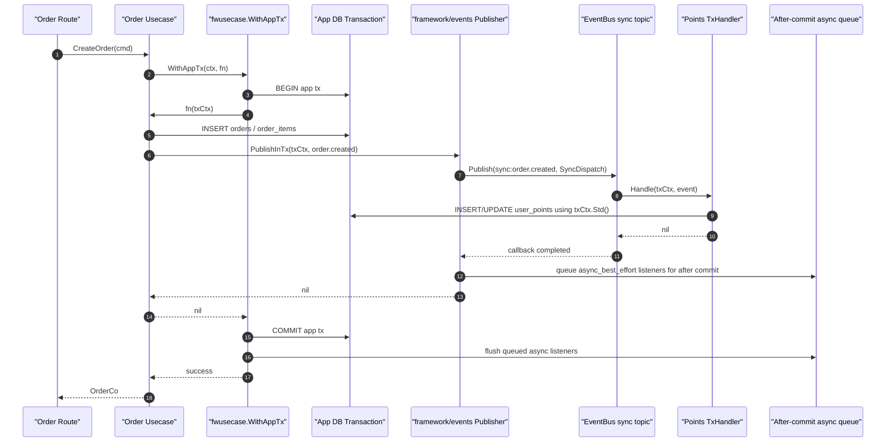
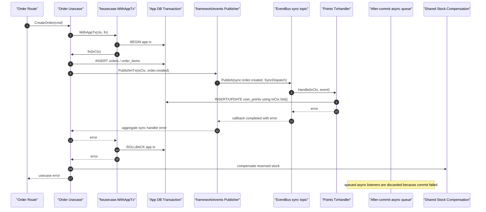

# Detailed Design: Framework EventBus Dual-Mode Module Decoupling

## Summary

Create `api/framework/events` as a framework-owned wrapper around
`github.com/asaskevich/EventBus`.

The wrapper provides two delivery modes:

```text
async_best_effort  async, loss-tolerant, no persistence, after-commit when in tx
sync_tx            synchronous, app-transactional, rollback on handler fail
```

One event topic can have both modes of subscribers. For example,
`order.created` can trigger:

* `points.reward_on_order_created` as `sync_tx`;
* `message.order_created_notification` as `async_best_effort`.

If sync handling fails, the app transaction rolls back and async handling is
not dispatched. If sync handling succeeds and the app transaction commits,
async handling is dispatched after commit.

The `sync_tx` design must not include framework event tables. Atomicity comes
from the points handler writing through the same `txCtx.Std()` app transaction
as the order usecase.

## Current Architecture Fit

### Package Boundary

New package:

```text
api/framework/events
```

Dependency rules:

* `api/framework/events` may import `github.com/asaskevich/EventBus`.
* `api/usecase` may import `api/framework/events`.
* `api/routes`, `api/usecase`, and `api/models` must not import
  `github.com/asaskevich/EventBus` directly.
* `api/models` must not import `api/framework/events`; event publishing belongs
  in usecases.
* Sync handlers that need persistence should call model functions with
  `ctx.Std()` so writes use the existing transaction-aware executor path.

### Transaction Constraint

Current app transaction flow:

```go
fwusecase.WithAppTx(ctx, func(txCtx fwusecase.Context) error {
    // app transaction is attached to txCtx.Std()
    return nil
})
```

Current `WithAppTx` delegates to `db.WithTx`, and `db.WithTx` commits after the
callback returns `nil`.

To support after-commit async dispatch, the framework needs a transaction hook
container attached to the standard context while the app transaction is active.
Callbacks are collected during the transaction and run only after `db.WithTx`
commits successfully.

## Event Model

### Event

```go
type Event struct {
    ID            string
    Topic         string
    AggregateType string
    AggregateID   string
    PayloadJSON   []byte
    MetadataJSON  []byte
    OccurredAt    time.Time
}
```

Rules:

* `ID` should be generated by the framework when absent.
* `Topic` must be non-empty and stable, e.g. `order.created`.
* `AggregateType` and `AggregateID` identify the business object.
* `PayloadJSON` should contain a stable DTO-like event payload, not a raw model
  struct when model internals are likely to change.
* `MetadataJSON` can include request ID, surface, actor, or consumer metadata.

### Delivery Mode

```go
type DeliveryMode string

const (
    DeliveryModeAsyncBestEffort DeliveryMode = "async_best_effort"
    DeliveryModeSyncTx          DeliveryMode = "sync_tx"
)
```

### Subscription

```go
type Subscription struct {
    Topic      string
    Subscriber string
    Mode       DeliveryMode
}
```

Rules:

* `Subscriber` must be stable and explicit.
* Good: `points.reward_on_order_created`.
* Good: `message.order_created_notification`.
* Bad: handler function name.
* Bad: Go type name.

## Framework API

### Handler Contracts

```go
type AsyncHandler interface {
    Handle(ctx context.Context, event Event) error
}

type TxHandler interface {
    Handle(ctx fwusecase.Context, event Event) error
}
```

Async handlers receive `context.Context` because they must not share the active
app transaction.

Sync handlers receive `fwusecase.Context` so their model writes can call
`ctx.Std()` and join the active app transaction.

### Registry

```go
type Registry interface {
    RegisterAsync(subscription Subscription, handler AsyncHandler) error
    RegisterSync(subscription Subscription, handler TxHandler) error
    AsyncSubscribers(topic string) []Subscription
    SyncSubscribers(topic string) []Subscription
}
```

Registration rules:

* topic must be non-empty;
* subscriber must be non-empty;
* mode must match the registration method;
* duplicate `(topic, subscriber, mode)` registrations should return an error;
* registry should be initialized during application startup before routes serve
  requests.

### Publisher

```go
type Publisher interface {
    PublishAsync(ctx fwusecase.Context, event Event) error
    PublishInTx(ctx fwusecase.Context, event Event) error
}
```

Recommended package-level helpers can delegate to a default publisher:

```go
func PublishAsync(ctx fwusecase.Context, event Event) error
func PublishInTx(ctx fwusecase.Context, event Event) error
func RegisterAsync(sub Subscription, handler AsyncHandler) error
func RegisterSync(sub Subscription, handler TxHandler) error
```

## Async Best-Effort Mode

### When To Use

Use for work that is useful but not required:

* send message;
* fire-and-forget notification;
* non-critical telemetry;
* optional external API call.

### Semantics

```text
publish -> after commit if in tx -> EventBus async dispatch -> log failures
```

Properties:

* no event persistence;
* no execution persistence;
* no retry;
* no rollback coupling;
* handler failures do not fail the usecase;
* process crash can lose pending async events.

### PublishAsync Flow

1. Validate event metadata.
2. Resolve `async_best_effort` subscriptions for `event.Topic`.
3. If no subscribers exist, return `nil`.
4. Build an `AsyncDispatch` object with event and subscriber list.
5. If `ctx.Std()` carries an active after-commit queue, enqueue the dispatch.
6. Otherwise publish immediately through EventBus async callbacks.
7. Each async callback logs its own error with topic, event ID, and subscriber.

### Transaction Interaction

If called inside `fwusecase.WithAppTx`:

* async callbacks must not run immediately;
* callbacks run only after commit succeeds;
* rollback discards callbacks;
* commit success followed by process crash may still lose callbacks.

This matches "allowed to lose" semantics while avoiding side effects for rolled
back data.

## Sync Transaction Mode

### When To Use

Use for work that must be atomic with the main business transaction:

* order-created points reward;
* internal audit row;
* app DB projection;
* module-local app DB bookkeeping.

Do not use for:

* external API calls;
* email/SMS/webhooks;
* shared DB writes requiring atomicity with app DB.

### Semantics

```text
publish in app tx -> sync EventBus dispatch -> handler model writes join tx
-> success commits all / failure rolls back all
```

No framework event or execution table is part of this design. The core
transaction guarantee comes from:

1. `PublishInTx` runs inside `fwusecase.WithAppTx`;
2. EventBus invokes `sync_tx` handlers synchronously;
3. handlers receive `txCtx`;
4. handlers call model functions with `txCtx.Std()`;
5. model writes reuse the active app transaction through `db.ExecutorFor`.

### Order Points Reward Success Sequence

This is the concrete sequence for "create order, then award points" when the
points listener succeeds.



Important detail: `EventBus` is not opening a transaction. It is only invoking
the registered points handler synchronously. The handler receives `txCtx`, so
its model writes use `txCtx.Std()` and therefore reuse the same app transaction
as the order insert.

After commit, the following rows are visible together:

* `orders`
* `order_items`
* `user_points` or the equivalent points table

### Order Points Reward Failure Sequence

This is the concrete sequence when the points listener fails.



After rollback, none of these app DB writes remain:

* `orders`
* `order_items`
* `user_points`

The failure must be logged before returning the aggregate handler error. This
design does not add separate framework event audit tables.

### PublishInTx Flow

1. Require active app transaction on `ctx.Std()`.
2. Validate event metadata.
3. Resolve `sync_tx` subscriptions for `event.Topic`.
4. Resolve `async_best_effort` subscriptions for the same topic.
5. Create `SyncDispatch` containing:
   * transaction-aware `fwusecase.Context`;
   * event;
   * error recorder.
6. Publish to the EventBus sync topic.
7. Each sync callback:
   * invokes the typed `TxHandler`;
   * records any error.
8. If any sync subscriber failed, log failures and return an aggregate error.
9. If sync handling succeeded, enqueue async subscribers for after-commit
    dispatch.
10. Return `nil`; `fwusecase.WithAppTx` commits.

If step 8 returns an error, `fwusecase.WithAppTx` rolls back business writes,
including the order rows and points rows.

## EventBus Topic Strategy

Use internal topic suffixing/prefixing to avoid mixing async and sync callback
types on the same raw EventBus topic:

```text
sync:order.created
async:order.created
```

Framework API still exposes the business topic as `order.created`.

### Sync Callback Shape

```go
bus.Subscribe(syncTopic(sub.Topic), func(dispatch *SyncDispatch) {
    err := handler.Handle(dispatch.TxContext, dispatch.Event)
    dispatch.Record(sub, err)
})
```

### Async Callback Shape

```go
bus.SubscribeAsync(asyncTopic(sub.Topic), func(dispatch *AsyncDispatch) {
    err := handler.Handle(dispatch.Context, dispatch.Event)
    dispatch.Record(sub, err)
}, false)
```

`AsyncDispatch.Record` should log failures. It should not return errors to the
usecase.

## Transaction Hook Design

### Why Needed

The current `fwusecase.WithAppTx` returns only after `db.WithTx` commits or
rolls back. To dispatch async events only after commit, the framework needs a
hook container that survives inside the transaction callback and is flushed
after commit.

### Proposed Contracts

In `api/framework/usecase`:

```go
type AfterCommitFunc func(context.Context)

func RegisterAfterCommit(ctx Context, fn AfterCommitFunc) error
```

Internal context state:

```go
type txHooks struct {
    afterCommit []AfterCommitFunc
}
```

Updated `WithAppTx` shape:

```go
func WithAppTx(ctx Context, fn func(Context) error) error {
    hooks := newTxHooks()
    txCtx := ctx.WithStd(contextWithHooks(ctx.Std(), hooks))

    err := db.WithTx(txCtx.Std(), "app", func(txCtxStd context.Context) error {
        return fn(txCtx.WithStd(txCtxStd))
    })
    if err != nil {
        return err
    }
    hooks.runAfterCommit(ctx.Std())
    return nil
}
```

Implementation detail: because `db.WithTx` derives a new standard context, hook
state must be attached before calling `db.WithTx` and preserved when `txCtxStd`
is passed back through `ctx.WithStd(txCtxStd)`.

Nested app transactions should reuse the same hook container so callbacks run
once after the outermost successful commit.

### Hook Behavior

| Condition | After-commit behavior |
| --- | --- |
| no active transaction | `PublishAsync` dispatches immediately |
| transaction commits | queued callbacks run after commit |
| transaction rolls back | queued callbacks are discarded |
| after-commit callback fails | log only; usecase already committed |
| nested app transaction | callbacks run after outer commit only |

## Database Design

No framework event tables are part of this design.

For `sync_tx`, persistence belongs to the business handlers. In the order points
example, the points handler writes to the points table with `txCtx.Std()`, and
that write joins the order transaction.

## Error Handling

### Sync Errors

Sync handler errors should be aggregated and returned from `PublishInTx`.

Recommended error message shape:

```text
sync event handlers failed for order.created: points.reward_on_order_created: <err>
```

Usecase should wrap this as a normal internal usecase error when appropriate.

### Async Errors

Async handler errors should be logged and swallowed.

Do not return async errors to the usecase because async dispatch may happen
after the usecase has already committed.

## Logging

Use `api/framework/logging`.

Recommended component:

```text
events
```

Required fields:

* `mode`;
* `event_id`;
* `topic`;
* `aggregate_type`;
* `aggregate_id`;
* `subscriber`;
* `status`;
* `request_id` when present;
* `surface` when present;
* error message.

Required log points:

* async handler failed;
* sync handler failed;
* after-commit dispatch failed;
* duplicate subscription rejected;
* event validation failed when useful for debugging.

## Order Flow Example

Example subscriptions:

```go
events.RegisterSync(events.Subscription{
    Topic: "order.created",
    Subscriber: "points.reward_on_order_created",
    Mode: events.DeliveryModeSyncTx,
}, pointsRewardHandler)

events.RegisterAsync(events.Subscription{
    Topic: "order.created",
    Subscriber: "message.order_created_notification",
    Mode: events.DeliveryModeAsyncBestEffort,
}, messageHandler)
```

Usecase flow:

```go
err = fwusecase.WithAppTx(ctx, func(txCtx fwusecase.Context) error {
    createdOrder, createdItems, err := models.InsertOrderWithItems(txCtx.Std(), cmd.UserID, orderItems)
    if err != nil {
        return err
    }

    return events.PublishInTx(txCtx, OrderCreatedEvent(createdOrder, createdItems))
})
```

Result:

* points handler writes points in the same app transaction;
* points failure rolls back order and points;
* message handler is queued only after points succeeds;
* message handler runs only after app commit succeeds;
* shared stock compensation still runs if app transaction fails.

## Business-side Example Code

The examples below show how business modules should use the framework API.
They are illustrative design snippets, not production code added in this task.

### Shared Order Event Payload

Both scenarios can use the same domain event topic and payload shape.

```go
package usecase

import (
    "encoding/json"
    "time"

    "github.com/google/uuid"
    "github.com/tfnick/go-svelte-starter/api/framework/events"
    "github.com/tfnick/go-svelte-starter/api/models"
)

const OrderCreatedTopic = "order.created"

type OrderCreatedPayload struct {
    OrderID     string `json:"order_id"`
    UserID      string `json:"user_id"`
    Amount      int64  `json:"amount"`
    CreatedAt   string `json:"created_at"`
}

func OrderCreatedEvent(order *models.Order) (events.Event, error) {
    payload, err := json.Marshal(OrderCreatedPayload{
        OrderID:   order.ID,
        UserID:    order.UserID,
        Amount:    order.Amount,
        CreatedAt: order.CreatedAt,
    })
    if err != nil {
        return events.Event{}, err
    }

    return events.Event{
        ID:            uuid.New().String(),
        Topic:         OrderCreatedTopic,
        AggregateType: "order",
        AggregateID:   order.ID,
        PayloadJSON:   payload,
        OccurredAt:    time.Now(),
    }, nil
}
```

### Scenario 1: Order Created Sends SMS Asynchronously

Registration:

```go
type SMSSender interface {
    SendOrderCreated(ctx context.Context, userID string, orderID string) error
}

type OrderCreatedSMSHandler struct {
    sender SMSSender
}

func RegisterOrderSMSHandler(sender SMSSender) error {
    return events.RegisterAsync(events.Subscription{
        Topic:      OrderCreatedTopic,
        Subscriber: "sms.order_created",
        Mode:       events.DeliveryModeAsyncBestEffort,
    }, OrderCreatedSMSHandler{sender: sender})
}

func (h OrderCreatedSMSHandler) Handle(ctx context.Context, event events.Event) error {
    var payload OrderCreatedPayload
    if err := json.Unmarshal(event.PayloadJSON, &payload); err != nil {
        return err
    }

    return h.sender.SendOrderCreated(ctx, payload.UserID, payload.OrderID)
}
```

Usecase publish flow:

```go
func CreateOrder(ctx fwusecase.Context, cmd CreateOrderCmd) (OrderCo, error) {
    // validation and stock reservation omitted

    var order *models.Order
    var persistedItems []models.OrderItem

    err := fwusecase.WithAppTx(ctx, func(txCtx fwusecase.Context) error {
        createdOrder, createdItems, err := models.InsertOrderWithItems(txCtx.Std(), cmd.UserID, orderItems)
        if err != nil {
            return err
        }

        order = createdOrder
        persistedItems = createdItems

        event, err := OrderCreatedEvent(createdOrder)
        if err != nil {
            return err
        }

        return events.PublishAsync(txCtx, event)
    })
    if err != nil {
        // compensate shared stock and return error
    }

    // At this point the app transaction has committed.
    // The SMS handler is dispatched after commit and may fail without rolling
    // back the order.
    return orderCoFromModel(order, names), nil
}
```

Transaction behavior:

```text
BEGIN app tx
INSERT orders / order_items
PublishAsync(txCtx, order.created) -> queue after-commit async dispatch
COMMIT app tx
EventBus async dispatch -> sms.order_created handler
SMS failure -> log only
```

### Scenario 2: Order Created Awards Points Synchronously

Registration:

```go
type OrderPointsHandler struct{}

func RegisterOrderPointsHandler() error {
    return events.RegisterSync(events.Subscription{
        Topic:      OrderCreatedTopic,
        Subscriber: "points.reward_on_order_created",
        Mode:       events.DeliveryModeSyncTx,
    }, OrderPointsHandler{})
}

func (h OrderPointsHandler) Handle(ctx fwusecase.Context, event events.Event) error {
    var payload OrderCreatedPayload
    if err := json.Unmarshal(event.PayloadJSON, &payload); err != nil {
        return err
    }

    points := payload.Amount / 100
    if points <= 0 {
        return nil
    }

    return models.GrantUserPoints(ctx.Std(), models.GrantUserPointsCmd{
        UserID:  payload.UserID,
        OrderID: payload.OrderID,
        Points:  points,
    })
}
```

Usecase publish flow:

```go
func CreateOrder(ctx fwusecase.Context, cmd CreateOrderCmd) (OrderCo, error) {
    // validation and stock reservation omitted

    var order *models.Order
    var persistedItems []models.OrderItem

    err := fwusecase.WithAppTx(ctx, func(txCtx fwusecase.Context) error {
        createdOrder, createdItems, err := models.InsertOrderWithItems(txCtx.Std(), cmd.UserID, orderItems)
        if err != nil {
            return err
        }

        order = createdOrder
        persistedItems = createdItems

        event, err := OrderCreatedEvent(createdOrder)
        if err != nil {
            return err
        }

        return events.PublishInTx(txCtx, event)
    })
    if err != nil {
        // If points failed, WithAppTx has already rolled back:
        // orders, order_items, and points writes are all gone.
        // compensate shared stock and return error
    }

    return orderCoFromModel(order, names), nil
}
```

Transaction behavior:

```text
BEGIN app tx
INSERT orders / order_items
PublishInTx(txCtx, order.created)
EventBus sync dispatch -> points.reward_on_order_created handler
handler calls models.GrantUserPoints(txCtx.Std(), ...)

success:
  COMMIT app tx
  orders / order_items / points are persisted together

failure:
  PublishInTx returns error
  ROLLBACK app tx
  orders / order_items / points are rolled back together
```

## Tests Required

### Framework Transaction Hooks

* registering after-commit outside a transaction returns an error or dispatches
  immediately through the publisher path;
* callbacks run after a successful `WithAppTx` commit;
* callbacks do not run after callback error/rollback;
* nested app transaction callbacks run once after outer commit.

### Async Best-Effort

* `PublishAsync` outside transaction dispatches async subscriber.
* `PublishAsync` inside transaction dispatches after commit.
* `PublishAsync` inside rolled-back transaction does not dispatch.
* async handler failure is logged and does not fail usecase.
* async event does not create framework event/execution rows.

### Sync Transaction

* `PublishInTx` requires an active app transaction.
* sync handler writes join the active app transaction.
* sync handler failure rolls back business writes from both publisher and
  handler.
* multiple sync subscribers all execute.
* async subscribers for same topic dispatch after commit when sync succeeds.
* async subscribers for same topic do not dispatch when sync fails.

### Architecture Guard

* `api/routes`, `api/usecase`, and `api/models` do not import
  `github.com/asaskevich/EventBus`.
* `api/models` does not import `api/framework/events`.
* no `api/framework/outbox` package is created for this task.
* no framework event/execution tables are created for this task.

## Implementation Plan

### PR 1: Framework Contracts + Dependency

* Add EventBus dependency.
* Add `api/framework/events` package.
* Define event, delivery mode, subscription, registry, handlers, and publisher.
* Add duplicate registration validation.

### PR 2: Transaction Hook Support

* Extend `api/framework/usecase` with after-commit hooks.
* Preserve hook state through `WithAppTx`.
* Add hook tests including nested transaction behavior.

### PR 3: EventBus Dispatch

* Implement async registration and dispatch.
* Implement sync registration and dispatch.
* Implement `PublishAsync` and `PublishInTx`.
* Add logging and aggregate error handling.

### PR 4: First Domain Event Demo/Test

* Add `order.created` event creation in order usecase.
* Add sync points reward demo/test handler.
* Add async message demo/test handler.
* Verify order rollback and after-commit behavior.

## Design Decision

Should `PublishInTx` automatically queue async subscribers for the same topic,
or should usecases call both `PublishInTx` and `PublishAsync` explicitly?

Decision: `PublishInTx` automatically queues async subscribers for the same
topic after all sync subscribers succeed. This keeps "publish one domain event"
semantics clean and allows subscribers to choose their delivery mode
independently.
