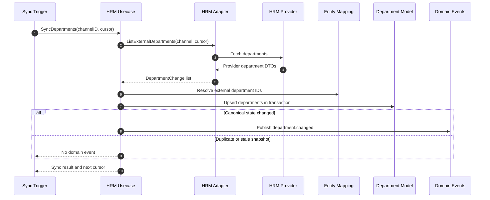
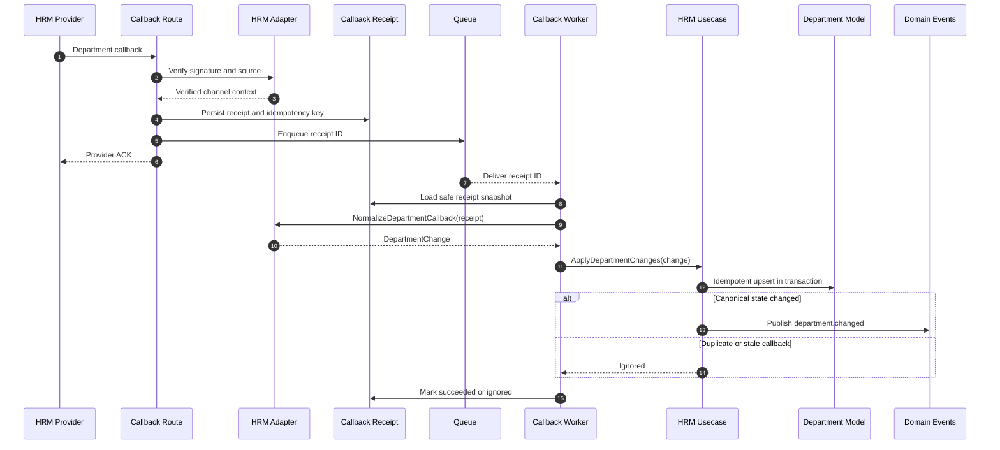
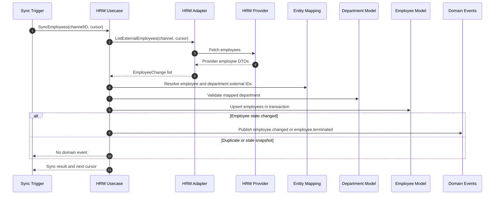
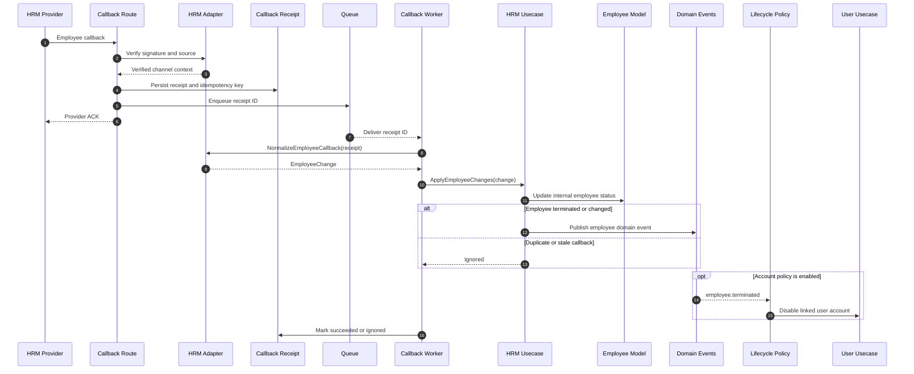
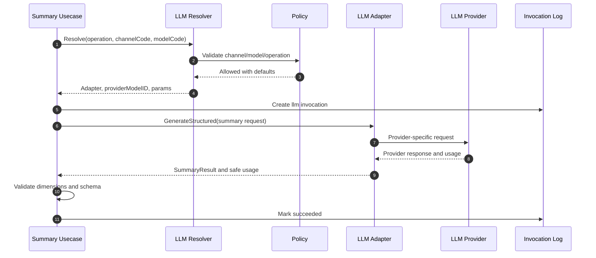
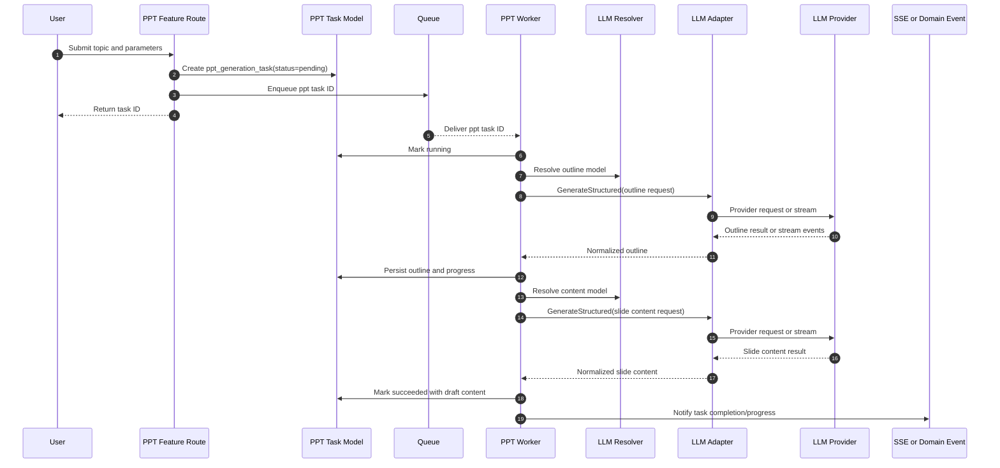

# Architecture Design: External Integration Anti-Corruption Layer

## Summary

本设计为当前项目引入一套外部系统集成防腐层规划，用于支付、HRM、短信、大模型、微信、企业微信等多场景、多渠道接入。

核心方向：

* 按业务场景优先组织目录，而不是按供应商优先组织。
* 业务侧依赖稳定 port 和业务 DTO，不能依赖 provider SDK、provider DTO、webhook payload 或 provider error code。
* 渠道配置以 DB 管理为主，支持 20+ 渠道的启停、优先级、环境、认证、黑白名单、回调开关和 provider metadata。
* 凭据采用 DB 加密存储，明文只允许出现在极窄的运行时解密边界。
* 回调采用持久化接收 + 队列异步处理，HTTP route 快速 ACK，业务处理幂等可重试。
* LLM streaming 是第一等集成形态，不能被强行塞进普通 request/response 或 durable callback queue。

本任务只输出架构设计，不新增生产代码、管理 API 或前端页面。

## Architecture Principles

### 1. Business Scenario First

顶层业务能力按场景表达：

```text
payment
sms
llm
hrm
wechat
work_wechat
```

供应商和渠道是该场景下的 adapter，例如：

```text
payment/adapters/alipay
payment/adapters/wechat_pay
sms/adapters/aliyun_sms
llm/adapters/openai
llm/adapters/anthropic
```

这样做的目标是让核心业务语言稳定。业务 usecase 只说 “send SMS”、“create payment”、“stream LLM response”，不说 “call Aliyun”、“call OpenAI chunk event”。

### 2. Ports And Adapters

业务 usecase 定义 port，provider adapter 实现 port。

```text
routes
  -> usecase business workflow
     -> scenario port
        <- provider adapter
           -> framework integration primitives
```

依赖方向：

* `api/usecase/integrations/<scenario>` 定义业务 port、业务 DTO、命令、结果、stream event。
* `api/integrations/<scenario>/<provider>` 实现具体 provider adapter。
* `api/integrations` 可以导入 `api/usecase/integrations/<scenario>` 来实现 port。
* `api/usecase` 不导入 `api/integrations`，避免业务层反向依赖 provider 实现。
* `index.go` 或启动 bootstrap 负责组装 registry，把 adapter 注入到 usecase 可见的 resolver。

### 3. Framework Is Provider-Agnostic

`api/framework` 只能放业务无关、供应商无关的基础能力。

适合放入 framework 的能力：

* outbound HTTP client wrapper：timeout、retry policy、request ID、redaction hooks。
* auth/signing primitives：Bearer、Basic、API key header、HMAC signing、timestamp nonce helper、RSA/ECDSA signing helper。
* credential encryption boundary：encrypt/decrypt、key version、masking。
* stream primitives：SSE decoder、bounded stream buffer、cancellation helper。
* safe provider error base type：category、retryable、safe message、provider request ID。
* redaction utilities：mask secret、strip sensitive fields。

不应放入 framework 的内容：

* `OpenAIClient`、`AliyunSMSClient`、`WeChatPayClient`。
* payment、sms、llm 等业务语义。
* provider request/response DTO。
* channel selection business rules。
* callback payload mapping to business state。

## Proposed Directory Layout

推荐引入一个新的 adapter 层目录 `api/integrations`。这需要后续更新 `.trellis/spec/backend/directory-structure.md` 和 archguard。

```text
api/
  framework/
    integrations/
      httpclient/
      auth/
      signing/
      credentials/
      stream/
      providererror/

  usecase/
    integrations/
      payment/
        ports.go
        commands.go
        results.go
        callbacks.go
        events.go
      sms/
        ports.go
        commands.go
        results.go
      llm/
        ports.go
        commands.go
        results.go
        model_selection.go
        structured.go
        stream_events.go
      hrm/
        ports.go
        commands.go
        results.go
        callbacks.go
        events.go
      wechat/
        ports.go
        callbacks.go
      work_wechat/
        ports.go
        callbacks.go
      registry/
        resolver.go
        channel_policy.go

  integrations/
    registry/
      bootstrap.go
    payment/
      alipay/
      wechat_pay/
    sms/
      aliyun_sms/
      tencent_sms/
    llm/
      deepseek/
      openai/
      anthropic/
    hrm/
      example_hrm/
    wechat/
      official_account/
      mini_program/
    work_wechat/
      contacts/
      messages/

  models/
    integration_channel.go
    integration_credential.go
    integration_policy.go
    integration_model_option.go
    integration_callback_receipt.go
    integration_invocation.go
    integration_delivery_attempt.go
    integration_entity_mapping.go

  routes/
    integration_callbacks.go
```

### Why Add `api/integrations`

Provider adapters are not business usecases, and they are not framework primitives. They are infrastructure adapters that translate between stable business ports and unstable external provider contracts.

Putting adapters directly under `api/usecase` would keep everything near the business scenario, but it would also tempt business code to import provider SDKs and DTOs. A separate `api/integrations` layer makes the boundary visible.

## Responsibility Matrix

| Layer | Responsibility | Must Not Do |
| --- | --- | --- |
| `routes` | HTTP binding, callback ingress, provider ACK shape, request context | Business state mutation directly, provider SDK calls |
| `usecase` | Business orchestration, port definitions, scenario DTOs, transaction/event decisions | Parse provider headers, import provider SDKs, log secrets |
| `api/integrations` | Provider adapter implementation, provider DTO mapping, auth request shaping, callback verification | Own business truth, persist directly unless through approved model/usecase path |
| `models` | Channel config, encrypted credentials, callback receipts, invocation records | Decode provider business meaning, call provider SDKs |
| `framework/integrations` | Generic HTTP/auth/signing/stream/encryption/error primitives | Know provider names, business scenarios, callback semantics |
| `framework/events` / `framework/queue` | Durable delivery and retry mechanics | Store provider-specific business state |

## Conceptual Data Model

This is not a migration spec yet. It is a concept model for later implementation tasks.

### `integration_channels`

Represents a manageable channel under a business scenario.

```text
id
scenario              # payment, sms, llm, hrm, wechat, work_wechat
channel_code          # stable business-facing channel code
provider_code         # alipay, wechat_pay, openai, anthropic, aliyun_sms
adapter_key           # code-owned adapter identifier
environment           # sandbox, production, test, custom
enabled
priority
credential_id
policy_id
callback_enabled
config_json           # provider-specific non-secret config
metadata_json
created_at
updated_at
```

Rules:

* `adapter_key` selects code-owned adapter; DB must not store executable logic.
* `config_json` can store non-secret provider parameters, but not credentials.
* `scenario + channel_code + environment` should be unique.
* `credential_id` can point to a single encrypted credential or an encrypted credential bundle. If an implementation needs multiple independently rotated secrets per channel, introduce a credential-set relation in that implementation task.

### `integration_credentials`

Stores encrypted credentials.

```text
id
credential_type       # api_key, client_secret, private_key, webhook_secret, oauth_client
ciphertext
key_version
masked_value
enabled
rotated_at
created_at
updated_at
```

Rules:

* plaintext must never be returned to routes, frontend DTOs, logs, domain events, or error messages.
* decryption happens only inside framework credential boundary or adapter setup.
* master key source and rotation process must be explicit in implementation design.

### `integration_policies`

Represents blacklist/whitelist and operational policy.

```text
id
scenario
name
allowlist_json
denylist_json
rate_limit_json
risk_rules_json
enabled
created_at
updated_at
```

Policy examples:

* callback source IP allowlist;
* target phone/email/account denylist;
* allowed LLM model list;
* payment amount/channel restrictions;
* tenant/account/channel allowlist.

Framework may provide generic matching helpers, but business usecase owns policy meaning.

### `integration_model_options`

Represents business-visible model choices for model-based integrations such as LLM.

```text
id
scenario              # llm
channel_id
model_code            # business-visible stable alias, for example summary-fast
provider_model_id     # provider model name/id used only by resolver/adapter
capabilities_json     # stream, structured_output, tool_call, vision, max_context, max_output
default_params_json   # temperature, top_p, max_tokens, response_format
cost_policy_json
enabled
created_at
updated_at
```

Rules:

* business usecases may request `channel_code` and `model_code`, but should not depend on raw provider model IDs;
* resolver maps `channel_code + model_code` to `channel_id + provider_model_id`;
* if no model is specified, scenario policy selects the default model for the operation;
* policy must validate whether the operation may use the requested channel/model;
* first LLM vertical slice should configure DeepSeek model aliases in DB, not hardcode model names in business usecases;
* prompt templates and product schemas remain business-owned. Model options describe provider capability, not product behavior.

### `integration_callback_receipts`

Records inbound callbacks before asynchronous processing.

```text
id
scenario
channel_id
provider_event_id
idempotency_key
payload_hash
payload_ciphertext
safe_snapshot_json
headers_hash
status                 # received, queued, processing, succeeded, failed, ignored
attempts
last_error_code
received_at
processed_at
created_at
updated_at
```

Rules:

* idempotency key should be stable per provider event.
* raw provider payload should be stored in `payload_ciphertext` for audit, replay, and dispute handling.
* `payload_ciphertext` must be encrypted at rest and must not be exposed through ordinary query DTOs, route responses, domain events, or frontend pages by default.
* store `payload_hash` for dedupe/debug correlation and `safe_snapshot_json` for non-sensitive canonical fields that operators need to inspect.
* processing status belongs to project-owned tables, not goqite internals.

### `integration_invocations`

Records outbound calls for observability and retry analysis.

```text
id
scenario
channel_id
channel_code           # safe snapshot for audit
provider_code          # safe snapshot for audit
operation
idempotency_key
model_code             # optional, mostly for llm
provider_request_id
status                 # started, succeeded, failed, timeout, policy_denied
error_category
retryable
usage_json             # optional safe usage counters, not prompts or chunks
duration_ms
created_at
updated_at
```

Rules:

* do not store raw request body or raw response body by default.
* store safe metadata only.
* snapshot safe channel/model fields so historical invocation records remain meaningful after config changes.
* if payload audit is required later, design an explicit encrypted audit table.

### `integration_delivery_attempts`

Records each attempt for operations that may be resent after confirmed failure, such as SMS delivery.

```text
id
invocation_id
scenario
operation
attempt_no
channel_id
provider_code
idempotency_key
status                 # pending, sending, succeeded, failed, skipped
error_category
retryable
next_action_at
provider_request_id
created_at
updated_at
```

Rules:

* one business request can have multiple attempts;
* attempts may use the same channel for manual resend or another channel for manual channel switch;
* channel switching must be initiated explicitly by an operator or approved business workflow, not hidden inside adapter code;
* resend eligibility uses normalized provider error categories, not raw provider error text;
* attempt records must not contain SMS content or raw provider payload by default.

### `integration_entity_mappings`

Maps external provider entity identities to internal canonical model identities.

```text
id
scenario
channel_id
provider_code
entity_type            # department, employee, customer, external_account
external_id
internal_id
external_parent_id
external_version
external_updated_at
metadata_json
created_at
updated_at
```

Rules:

* external IDs must not become primary business model IDs by default;
* `(scenario, channel_id, entity_type, external_id)` should be unique;
* mapping rows allow outbound sync and inbound callbacks to converge on the same internal entity;
* `external_version`, `external_updated_at`, or a payload hash should be used to ignore stale or duplicate provider changes;
* entity-specific business tables still own canonical state. This table only records integration identity mapping.

## Outbound Call Flow

Example: send SMS.

```text
business usecase
  -> sms.Send(ctx, cmd)
  -> channel resolver loads enabled channels from DB
  -> policy evaluator checks allowlist/denylist/rate limits
  -> credential boundary decrypts credential for chosen channel
  -> provider adapter maps business command to provider request
  -> framework HTTP client executes request with timeout/retry/redaction
  -> provider adapter maps provider response/error to business result/error
  -> usecase returns stable Co or publishes business event
```

Important rules:

* business usecase does not switch on 20 provider names;
* channel selection belongs to resolver/policy;
* provider errors are normalized before crossing into business layer;
* provider request IDs may be kept as safe metadata;
* retry behavior must distinguish idempotent vs non-idempotent operations.

## Outbound Failure And Manual Resend

SMS delivery should not use system-level automatic channel failover by default. The safer model is:

1. System sends through the selected channel and records the attempt.
2. If the provider confirms failure, the delivery becomes eligible for manual resend.
3. An operator or approved business workflow manually chooses:
   * resend with the original channel;
   * resend with a different channel;
   * mark as ignored/no resend.

This avoids duplicate SMS caused by ambiguous timeouts or provider retry behavior.

### Manual Resend Decision Inputs

Manual resend eligibility should consider:

* normalized error category: `timeout`, `rate_limit`, `provider_internal`, `auth`, `policy_denied`, `validation`;
* whether the failure is confirmed or ambiguous;
* provider delivery callback state;
* provider query result when supported;
* scenario operation idempotency;
* target allowlist/denylist policy;
* operator permission and audit trail;
* whether the same `message_id` has already succeeded on any channel.

### SMS Example

```text
business usecase -> sms.Send(ctx, cmd)
  -> create integration_invocation
  -> resolver chooses channel A by priority/policy
  -> create delivery attempt #1 for channel A
  -> adapter A send
  -> provider confirms failure or query marks failed
  -> delivery status becomes failed_resendable
  -> operator chooses resend on channel A or channel B
  -> create delivery attempt #2 with selected channel
  -> adapter sends through selected channel
  -> record result and audit operator action
```

SMS should avoid automatic cross-channel resend after ambiguous timeouts, because the first provider may still deliver the message. The design needs an idempotency and duplicate-suppression strategy:

* use a business-level `message_id` or `dedupe_key`;
* store every attempt under that key;
* if provider supports idempotency keys, pass the key to the provider adapter;
* require confirmed failure before manual resend is enabled;
* record manual resend operator, selected channel, reason, and previous attempt state.

### Business Result Shape

The business layer should receive a stable result, not provider details:

```text
accepted
delivery_id
channel_code
final_status          # accepted, failed_resendable, failed_final, ignored
```

Provider request IDs and raw error details stay in integration invocation/attempt metadata.

## Callback Flow

Example: payment provider callback.

```text
provider -> callback route
  -> identify scenario/channel
  -> load channel config
  -> verify signature/timestamp/nonce/IP policy
  -> compute idempotency key
  -> persist callback receipt
  -> enqueue integration callback job
  -> return provider-specific ACK quickly

worker -> load receipt
  -> provider adapter normalizes callback payload
  -> usecase applies business command/event idempotently
  -> mark receipt succeeded/failed/ignored
```

Callback route responsibilities:

* HTTP binding and provider ACK shape.
* Provider-specific signature verification through adapter.
* Source policy checks before business processing.
* Receipt persistence and enqueue.

Worker responsibilities:

* Load receipt by ID.
* Ask adapter to normalize payload into business command/event.
* Call scenario usecase or publish domain event.
* Update receipt status.

Business processing must be idempotent because providers retry and network acknowledgements are not reliable.

## HRM Validation Walkthrough

This HRM scenario validates that the proposed anti-corruption layer handles both outbound pull sync and inbound callback sync without leaking provider vocabulary into core models.

### Important Boundary

The project currently has a `users` model for authentication and user management, but it does not yet have dedicated `departments` or `employees` domain models. A future HRM integration should therefore introduce or target canonical internal department and employee models instead of treating HRM employees as login users.

If an employee lifecycle change should affect a login account, that should be handled by a business policy after the internal employee model changes. The HRM adapter should not directly disable `users`.

### HRM Ports

Stable business-facing ports should cover both pull sync and callback normalization.

```text
SyncDepartments
SyncEmployees
ListExternalDepartments
ListExternalEmployees
NormalizeDepartmentCallback
NormalizeEmployeeCallback
```

Provider adapters return normalized business changes, not provider DTOs.

```text
DepartmentChange:
  external_id
  external_parent_id
  name
  code
  status
  version
  changed_at

EmployeeChange:
  external_id
  department_external_id
  name
  email
  mobile
  status              # active, suspended, terminated
  resigned_at
  version
  changed_at
```

### Department Pull Sync

```text
scheduled/manual usecase
  -> hrm.SyncDepartments(channel_id, cursor/since)
  -> adapter lists provider departments
  -> adapter maps raw departments to DepartmentChange
  -> usecase resolves integration_entity_mappings
  -> usecase upserts internal departments in a transaction
  -> usecase publishes department domain events only when canonical state changed
  -> usecase records invocation, cursor, and safe metadata
```



### Department Callback Sync

```text
provider callback route
  -> adapter verifies signature/source
  -> integration_callback_receipts stores receipt
  -> queue worker loads receipt
  -> adapter normalizes callback to DepartmentChange
  -> same ApplyDepartmentChanges usecase path as pull sync
```

The callback path and pull-sync path must converge on the same internal apply logic. This prevents one path from missing validation, stale-event handling, or domain event publication.



### Employee Pull Sync

```text
scheduled/manual usecase
  -> hrm.SyncEmployees(channel_id, cursor/since)
  -> adapter lists provider employees
  -> adapter maps raw employees to EmployeeChange
  -> usecase resolves department and employee mappings
  -> usecase upserts internal employees in a transaction
  -> usecase publishes employee domain events only when canonical state changed
```



### Employee Callback Sync

```text
provider employee callback
  -> persistent receipt
  -> queue worker
  -> NormalizeEmployeeCallback
  -> ApplyEmployeeChanges
  -> update internal employee status, for example terminated
  -> publish employee.terminated or employee.changed if state changed
```

For a resignation callback, the HRM scenario should update the internal employee model first. Any follow-up action such as disabling a login user, revoking sessions, notifying managers, or changing permissions should be modeled as a separate business usecase or domain-event subscriber.



### Idempotency And Ordering

HRM providers may send duplicate callbacks, stale snapshots, or out-of-order events. The apply layer should:

* dedupe by provider event ID or stable idempotency key at `integration_callback_receipts`;
* resolve external IDs through `integration_entity_mappings`;
* compare provider version, provider update time, or payload hash before mutating internal models;
* ignore stale callbacks without marking the receipt as failed;
* publish domain events only after the internal canonical model actually changed.

### Verdict

The current design supports the HRM scenario if these two clarifications are kept explicit:

* external entity mapping is a first-class integration concept;
* pull sync and callback sync both normalize into the same business apply usecases.

With those clarifications, the design keeps framework, provider adapter, and business model responsibilities cleanly separated.

## LLM Streaming Flow

LLM integrations need three invocation shapes.

### Shape 1: Final Response

```text
LLM request -> provider -> final business response
```

Use for simple backend workflows where the user does not need live tokens.

### Shape 2: Online Stream

```text
LLM request
  -> provider SSE/event stream
  -> provider adapter normalizes raw events
  -> business-level stream events
  -> route/client transport or accumulator
```

Normalized stream event examples:

```text
started
text_delta
tool_call_delta
tool_call_done
reasoning_delta
usage_delta
heartbeat
completed
failed
```

Rules:

* live token streaming should not be forced through durable queue processing;
* stream methods must accept `context.Context` for cancellation;
* stream buffers must be bounded;
* slow downstream consumers should trigger backpressure, timeout, or cancellation;
* provider raw event names must not escape adapters;
* partial output persistence is opt-in and must be designed with sensitive-data handling.

### Shape 3: Background LLM Job

```text
business request -> queue job -> LLM final/stream accumulator -> business result/event
```

Use when live streaming is not required, for example offline summarization, batch classification, or async review.

In this mode the worker can consume provider streaming internally and persist only final safe output plus metadata.

## LLM Validation Walkthrough

The LLM scenarios validate whether the anti-corruption layer supports model selection, long-running work, streaming, and product-specific schemas without exposing provider DTOs to business code.

### Important Boundary

LLM is an external integration scenario, but product features such as text summarization or intelligent PPT generation are still business usecases. The LLM adapter should only know how to call a provider and normalize responses or stream events. It should not own product prompt policy, PPT outline schema, document persistence, user authorization, or feature-specific status models.

Business usecases may specify stable `channel_code` and `model_code` when the product needs explicit routing. These are project-owned aliases resolved through DB configuration, not provider SDK types or raw provider model IDs.

For product users, channel/model selection should not be exposed in the first implementation. Backend/admin configuration chooses the channel and model per operation.

### LLM Ports

Stable business-facing ports should cover final responses, streams, embeddings, and structured generation.

```text
Complete
Stream
GenerateStructured
Embed
ResolveModel
```

The command shape should stay provider-neutral.

```text
LLMRequest:
  operation             # summarize_text, generate_ppt_outline, generate_ppt_content
  channel_code          # optional business-visible channel alias
  model_code            # optional business-visible model alias
  messages
  response_schema       # optional business-owned structured output schema
  params                # provider-neutral generation params
  idempotency_key
```

The resolver maps `channel_code + model_code + operation` to an enabled channel, credentials, provider adapter, provider model ID, default params, and policy decisions.

### Text Multi-Dimension Summarization

This scenario is a good fit for `GenerateStructured` or `Complete` with a business-owned result schema.

```text
business usecase
  -> llm.GenerateStructured(SummarizeTextRequest)
  -> resolver checks requested channel/model or chooses policy default
  -> adapter maps business messages/schema to provider request
  -> provider returns text or structured output
  -> adapter normalizes result and usage
  -> business usecase validates summary dimensions
  -> usecase stores or returns canonical summary result
```



Rules:

* channel/model selection can be explicit in backend/admin configuration, but must use stable aliases such as `deepseek-prod` and `summary-fast`;
* if the user or business feature cannot choose any model, policy should choose the default;
* allowed models should be constrained by `integration_model_options` and `integration_policies`;
* prompt text, source text, and generated summaries should not be stored in generic integration logs;
* usage counters may be stored in `integration_invocations.usage_json` if they are safe and useful for cost analysis.

### Intelligent PPT Generation

This scenario is long-running and product-specific. It should not be modeled as a single blocking route that waits for all LLM calls to finish. The safer default is a project-owned PPT generation job with LLM calls inside the worker.

```text
feature route
  -> create ppt_generation_task with user input and status
  -> enqueue technical job
  -> return task ID quickly

worker
  -> load task
  -> call LLM to generate outline, optionally as stream accumulator
  -> validate outline schema
  -> call LLM to generate slide content
  -> persist PPT content draft and task progress
  -> publish product event or notify frontend through SSE
```



For the frontend experience, there are two valid modes:

* async task mode: route returns `task_id`, frontend polls or subscribes to SSE progress, worker persists the final draft;
* online stream mode: route opens an LLM stream for live outline/content preview, but still needs cancellation, bounded buffers, and explicit persistence rules.

Given the "响应时间比较长" condition, the default should be async task mode, optionally with SSE progress updates. Durable queue is appropriate for task execution, while provider token streams are consumed inside the worker and accumulated into business results.

### Resource Control For PPT Generation

PPT generation is resource-heavy and should be protected by both rate limiting and queue execution.

Rate limiting protects the entry point and cost budget:

* per-user submission rate, for example requests per minute/hour;
* per-user concurrent running tasks;
* per-tenant or global daily token/cost budget;
* per-channel/model rate limits based on provider quota;
* input size limits for topic, reference text, outline depth, and slide count.

Queue execution protects long-running work:

* the route should create `ppt_generation_task`, enqueue a job, and return quickly;
* worker concurrency should be capped globally and per channel/model;
* queue depth should be monitored. When the queue is saturated, the route should reject new tasks with a safe business error instead of accepting infinite backlog;
* task status should live in project tables, not goqite internals;
* retries should happen at explicit task-step boundaries such as outline generation and slide-content generation;
* cancellation should mark the task cancelled and ask the worker to stop before starting the next expensive LLM step.

Recommended task states:

```text
pending
queued
running
outline_generated
content_generating
succeeded
failed
cancelled
```

Recommended limits:

```text
max_pending_tasks_per_user
max_running_tasks_per_user
max_global_ppt_workers
max_running_tasks_per_channel
max_queue_depth
max_slides_per_task
max_prompt_input_chars
daily_token_budget_per_user_or_tenant
```

This keeps PPT generation from exhausting HTTP workers, LLM quota, DB connections, file storage, or frontend patience. The queue is not only an implementation convenience; it is part of the product's resource-control boundary.

### LLM Idempotency And Cost Control

LLM calls are expensive and may create different outputs on retry. Usecase should:

* require a business idempotency key for long-running jobs;
* persist product task state outside goqite, for example `ppt_generation_tasks`;
* make retries explicit at task-step level, not hidden inside the adapter for non-idempotent generation;
* record safe usage counters and model/channel aliases for audit;
* keep prompts and generated chunks out of generic logs and domain events;
* publish domain events only for product facts such as `ppt_generation.completed`, not for raw provider chunks.

### Verdict

The design supports these LLM scenarios if model selection is treated as DB-backed policy and alias resolution, and if long-running product workflows own their own task state. The LLM adapter remains a provider anti-corruption boundary; summarization and PPT generation remain business usecases.

## Provider Error Model

Adapters should map provider failures to a normalized error shape before crossing into usecase.

```text
category       # auth, rate_limit, timeout, validation, policy_denied, temporary, permanent, provider_internal
retryable
safe_message
provider_code
provider_request_id
cause          # internal only, redacted
```

Mapping examples:

| Provider condition | Normalized category | Retry |
| --- | --- | --- |
| invalid credential | `auth` | no |
| rate limit | `rate_limit` | yes, with backoff |
| provider timeout | `timeout` | depends on operation idempotency |
| malformed business input | `validation` | no |
| whitelist denied | `policy_denied` | no |
| provider 5xx | `provider_internal` | yes |

Usecase can then translate failures into `fwusecase.E(...)` with safe messages.

## Security And Logging

Sensitive data must not enter logs, errors, events, frontend DTOs, or ordinary business tables.

Never write these values to ordinary application logs, errors, events, frontend DTOs, or generic feature tables:

* raw credentials;
* raw callback payloads;
* provider request/response bodies;
* LLM prompts;
* LLM streamed chunks;
* tool call arguments;
* private keys or webhook secrets.

Recommended log fields:

```text
component="integrations"
scenario
channel_id
provider_code
operation
request_id
integration_invocation_id
callback_receipt_id
provider_request_id
status
duration_ms
retry_count
error_category
```

For callback idempotency keys, log a hash or internal receipt ID rather than provider raw values when the value may be sensitive.

### Raw Callback Payload Retention

Raw callback payloads should be stored in `integration_callback_receipts.payload_ciphertext`, not in ordinary logs or feature tables. This makes the receipt table the system of record for callback audit and replay.

Rules:

* encrypt the payload at rest;
* keep `payload_hash` for dedupe and correlation;
* expose only `safe_snapshot_json` in normal admin query surfaces;
* restrict raw payload access to operational audit roles;
* record access to raw payload reads;
* define retention and purge behavior explicitly in implementation;
* never forward the raw payload to domain events, ordinary logs, route responses, frontend DTOs, or scenario feature tables.

Scenario business usecases should consume normalized commands/events derived from the callback. They should not read or persist provider raw payloads as domain state.

## Relationship To Existing DDD Events And Queue

Use durable domain events for business facts:

```text
payment.succeeded
sms.delivery_reported
hrm.employee_changed
wechat.message_received
```

Use technical queue jobs for integration mechanics:

```text
integration-callbacks
integration-retries
integration-background-llm
```

Do not store project delivery state in goqite. Project-visible status belongs to project-owned tables such as `integration_callback_receipts` and `integration_invocations`.

For product workflows such as intelligent PPT generation, the queue job is feature-owned, for example `ppt-generation`. Its business-visible state belongs to product tables such as `ppt_generation_tasks`. Each LLM provider call inside the worker can still record an `integration_invocation`, but the integration layer should not own the PPT task lifecycle.

## Domain Event Placement

The current project defines business event payloads and constructors under `api/usecase/events`. This remains a good default for the anti-corruption-layer design.

### Keep Domain Events Usecase-Owned

Domain events are internal business facts. They should stay owned by the application/business layer, not by provider adapters.

Good examples:

```text
order.paid
payment.succeeded
sms.delivery_reported
hrm.employee_changed
wechat.message_received
```

These events are expressed in business language after provider-specific payloads have already been normalized.

Do not move domain event definitions to:

* `api/framework/events`: framework must stay business-agnostic and only provide durable event mechanics.
* `api/integrations`: provider adapters must not own business facts.
* `api/models`: persistence must not publish or define application events.
* `routes`: HTTP adapters must not publish domain events directly.

### Distinguish Three Event-Like Concepts

External integrations introduce multiple "event-like" concepts. They should not all become DDD domain events.

| Concept | Example | Owner | Storage/Delivery |
| --- | --- | --- | --- |
| Provider raw callback | WeChat encrypted callback body, payment gateway webhook payload | provider adapter / callback route edge | `integration_callback_receipts.payload_ciphertext` plus hash/safe snapshot |
| Technical integration job | process callback receipt, retry outbound invocation, background LLM job | integration pipeline | goqite technical queue plus project-owned status tables |
| Business domain event | `payment.succeeded`, `sms.delivery_reported`, `hrm.employee_changed` | usecase-owned event package | `domain_events` / `domain_event_deliveries` |

Only the third category is a DDD domain event.

### Current Package vs Future Split

For the current codebase, keeping `api/usecase/events` is acceptable and consistent with the existing eventing spec:

```text
api/usecase/events/
  durable_store.go
  order_paid_points.go
  payment_events.go
  sms_events.go
  hrm_events.go
```

However, as external integration scenarios grow, a single flat event package can become a "god catalog". A future refactor can split event definitions by business scenario while preserving the same ownership rule:

```text
api/usecase/payment/events/
api/usecase/sms/events/
api/usecase/hrm/events/
api/usecase/wechat/events/
```

The trigger for that refactor should be real growth or import-cycle pressure, not the mere existence of `api/integrations`.

### Recommended Rule

Keep the current location for now:

```text
api/usecase/events
```

Add new external-integration-derived business events there only after provider payloads are normalized. Treat provider callback receipts and technical processing jobs as integration pipeline records/jobs, not domain events.

## Scenario Examples

### Payment

Port:

```text
CreatePayment
QueryPayment
RefundPayment
NormalizePaymentCallback
```

Callback processing should publish or call business logic for stable facts like payment succeeded, refund succeeded, payment closed.

### SMS

Port:

```text
SendSMS
QueryDelivery
NormalizeDeliveryCallback
```

Policy may include phone allowlist/denylist, rate limits, template restrictions, and tenant/channel routing.

SMS needs delivery orchestration above provider adapters:

* adapter only sends through one provider/channel;
* scenario orchestration records attempts and exposes manual resend choices after confirmed failure;
* `integration_delivery_attempts` records every try;
* ambiguous timeout should not automatically resend through another channel;
* manual resend can choose the original channel or a different channel, and must be audited;
* delivery callback should update the corresponding attempt/delivery state and can publish `sms.delivery_reported` as a business event after normalization.

### LLM

Port:

```text
Complete
Stream
GenerateStructured
Embed
ResolveModel
```

Streaming is first-class and uses normalized stream events. Background LLM jobs may use queues.

Business features can request `channel_code` and `model_code`, but the resolver maps those project-owned aliases to provider adapters and provider model IDs. Product schemas such as multi-dimension summary results or PPT outlines belong to business usecases, not provider adapters.

First implementation provider:

```text
provider_code: deepseek
adapter_key: llm.deepseek.openai_compatible
base_url: https://api.deepseek.com
models: deepseek-v4-flash, deepseek-v4-pro
```

DeepSeek should be called through its OpenAI-compatible API format. New implementation should prefer current model IDs and avoid introducing new configuration that depends on deprecated aliases.

### HRM

Port:

```text
SyncDepartments
SyncEmployees
GetDepartment
GetEmployee
NormalizeDepartmentCallback
NormalizeEmployeeCallback
```

HRM sync and callback flows should both normalize provider payloads into stable department or employee changes. The usecase layer applies those changes to internal canonical models through idempotent upsert logic, then publishes business domain events only after internal state changes.

HRM employees are not automatically authentication users. If an employee termination should disable a login account, that action belongs to an employee lifecycle policy or event subscriber, not the provider adapter.

### WeChat / Work WeChat

Port:

```text
SendMessage
SyncContacts
NormalizeMessageCallback
NormalizeContactCallback
```

Callback verification and provider ACK formats are adapter responsibilities. Business usecases consume stable commands/events only.

## Enforceable Rules For Future Implementation

Future implementation should add archguard/spec rules:

* `api/usecase` must not import provider SDKs.
* `api/framework` must not import provider SDKs or business scenario packages.
* `api/integrations` may import provider SDKs and scenario ports.
* provider DTO types must not appear in routes, models, or business usecase return types.
* raw credentials must not appear in route DTOs, logs, events, or tests except explicit secret-boundary tests.
* callback status tables must be project-owned, not added to goqite tables.

## Recommended Implementation Phases

### PR1: Specs And Archguard

* Update backend directory spec to introduce `api/integrations`.
* Add import-boundary archguard rules for provider SDK isolation.
* Add logging/security rules for integration payloads and credentials.

### PR2: Configuration And Credentials

* Add DB models/migrations for channels, credentials, policies, LLM model options, and invocation records.
* Add encrypted credential boundary.
* Add redaction/masking tests.

### PR3: Callback Receipt Pipeline

* Add callback route surface.
* Add receipt persistence and integration callback queue.
* Add idempotency and retry status tracking.

### PR4: LLM Vertical Slice

Implement the first vertical slice with LLM because it validates the widest set of new integration concerns:

* DeepSeek provider adapter through OpenAI-compatible API;
* channel/model alias resolution;
* model option configuration;
* provider invocation recording;
* streaming/final/structured response shapes;
* resource-controlled background task execution for intelligent PPT generation.

### PR5: Resource-Controlled LLM/PPT Task Pipeline

* Add product-owned `ppt_generation_tasks`.
* Add submission/concurrency/queue-depth limit checks.
* Add queued worker execution with capped concurrency.
* Add task progress, cancellation, and explicit step-level retry behavior.
* Record each provider call through `integration_invocations`.

### PR6: SMS Vertical Slice

* Add outbound SMS provider port and one adapter.
* Add delivery invocation and attempt recording.
* Add delivery callback normalization if supported by the first provider.
* Add confirmed-failure manual resend and manual channel switch flow.

### PR7: Payment Vertical Slice

* Add payment creation/query/refund ports and one adapter.
* Add callback receipt processing for payment result callbacks.
* Validate strong idempotency, state transition, and domain-event publication rules.

### PR8: HRM Vertical Slice

* Add department and employee sync ports plus one adapter.
* Add `integration_entity_mappings`.
* Validate pull sync and callback sync convergence into the same internal apply usecases.

### PR9: Management Surface

* Add internal management API.
* Add frontend pages for channel config, model options, credentials, policy, callback/invocation inspection, and product task inspection where needed.

## Trade-Offs

### Benefits

* Business logic stays independent from provider contracts.
* 20+ channels can scale through config and registry, not giant business switch/case.
* Callback handling is reliable and observable.
* LLM streaming is handled without weakening durable callback/event semantics.
* Security boundaries are explicit.

### Costs

* More packages and indirection.
* Requires bootstrap/registry discipline.
* DB-managed config requires validation, audit, and later management UI.
* Encrypted DB credentials require key management and rotation design.
* LLM streaming requires careful cancellation/backpressure handling.

## Open Follow-Up Decisions

These should be decided in later implementation tasks:

* master key source and rotation mechanism for encrypted DB credentials;
* callback route URL shape and provider ACK conventions;
* exact quota numbers for PPT generation limits;
* PPT progress notification mode: polling, existing SSE pattern, or a dedicated feature route;
* whether LLM stream events are forwarded to frontend through existing SSE patterns or a dedicated route.
